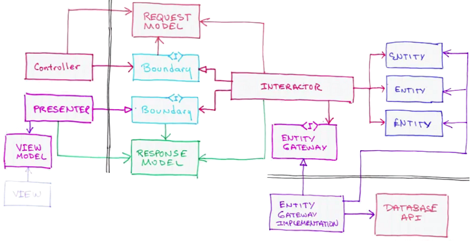
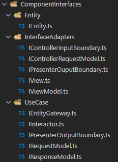
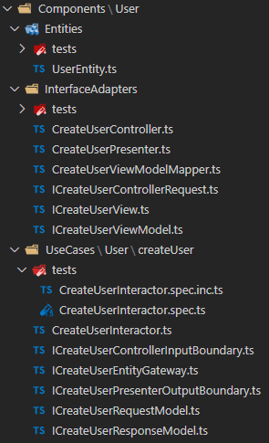
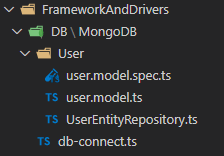
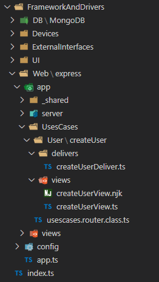
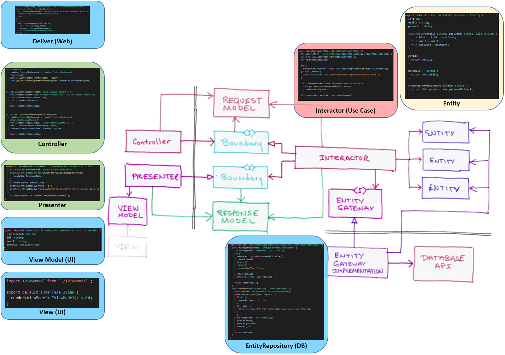

# Uncle Bob's clean architecture implementation in Typescript, with Express as Web Detail

version: 'v1.0.0'

## Description

Based on Uncle Bob's Clean Architecture, i tried to an implementation in Typescript with "screaming architecture" in folders and files.

First, i use separated components with an example :

```
./src/Components/User
```

As Web Detail, i used my own "Node.js server with express framework, craftsmanship way" :

- Clean project structure

- Tests Driven Development

- Test Coverage

- Copy/paste detection

```
./src/FrameworkAndDrivers/Web/express
```

https://github.com/Stayfi/nodejs-server

## Project structure

./scripts: Scripts used by package.json

./src: Application source code

---

./src/ComponentInterfaces: Clean architecture Interfaces, to represent the Uncle Bob's interfaces schema





---

./src/Components: Components, as "Packages by feature" with all feature use cases

./src/Components/User/Entities

./src/Components/User/InterfaceAdapters

./src/Components/UseCases/User

./src/Components/UseCases/createUser: "create user" use case for "User" feature



---

./src/FrameworkAndDrivers

./src/FrameworkAndDrivers/DB/MongoDB: MongoDB implementatin with connexion and repositories



---

./src/FrameworkAndDrivers/Web/express: Node.js server with express ( https://github.com/Stayfi/nodejs-server )



---

## Implementation schema


* Initialize the view to render viewModel datas with nunjucks template
```
./src/FrameworkAndDrivers/Web/express/app/UsesCases/User/createUser/views/createUserView.ts
```

* Entity gateway implementation with MongoDB
```
./src/FrameworkAndDrivers/DB/MongoDB/User/user.model.ts
```

* Deliver initialize controller with entity gateway and view, then execute controller with controllerRequestModel sended by Web implementation (express)
```
./src/FrameworkAndDrivers/Web/express/app/UsesCases/User/createUser/delivers/createUserDeliver.ts
```

* Controller initialize presenter with view received, initialize interactor with entity gateway and presenter, then execute interactor with controllerRequest datas mapped to requestUserModel
```
./src/Components/User/InterfaceAdapters/createUserController.ts
```

* Interactor execution do the business job with entity, entity gateway implementation, datas and then presente responseModel data
```
./src/Components/User/UseCases/User/createUser/CreateUserInteractor.ts
```

* Presenter, execute view renderer with responseModel data mapped to viewModel data
```
./src/Components/User/InterfaceAdapters/createUserPresenter.ts
```



## Install

### Dev installation

Go to the project directory and do

```bash
    $ npm run install:dev
```

### Production installation

Go to the project directory and do

```bash
    $ npm run install:prod
```

## Start the project

### Dev running

```bash
    $ npm run dev
```

Open your browser to : http://localhost:3000

### Prod running

```bash
    $ npm run start
```

Open your browser to : http://localhost:8080

## Running tests

```bash
    $ npm run test
```

Or simply :

```bash
    $ jest
```

## Running coverage

```bash
    $ npm run coverage
```

## Running copy/paste detection

```bash
    $ npm run jscpd
```

## Running tslint

```bash
    $ npm run tslint
```

With fix :

```bash
    $ npm run tslint:fix
```

## Clean the project

It remove all folders generated by build, test and coverage.

```bash
    $ npm run clean
```

## Package.json scripts

- "assets:config": copy config files to dist folder

- "assets:views": copy views assets to dist folder (nunjunks views)

- "install:dev": install all dependencies and dev dependencies

- "build:dev": run "assets:dist" and typescript compiler with watching

- "start:dev": running nodemon to monitor dist/app.js

- "install:prod": install only dependencies without dev dependencies
